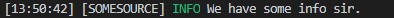

# el4js (Easy Logger For JavaScript)

## Why el4js?

el4js is a logger for javascript intended to be simple yet modular. There are certain levels of logging and can be configured.

The documentation for this porject is a work in progress.

### Features

- Full support for all logging levels.
- Beautiful logging.
- Object oriented.
- Colorful outputs.

### Support

Stuck somewhere? Feel free to join our [Discord server](https://discord.gg/jNYDJzZ2) and jump right into the #package-support channel.

## Getting Started

### Installation

Make sure you have node.js v12x installed. This package supports types out of the box.
Ignore any peer warnings as they are optional.

```console
npm i el4js
```

### Usage

This is a demo of how you would log an info message to the console using el4js.  
JavaScript:

```js
const el4js = require("el4js");
const logger = new el4js.Logger();

logger.info("We have some info sir.", "someSource");
```

Typescript:

```ts
import el4js from "el4js";
const logger = new el4js.Logger();

logger.info("We have some info sir.", "someSource");
```

Output:  


For a detailed usage, see the src/tests/index.js file on GitHub.

## Contributing

We are always looking out for people that may help improve this project. If you do want to contribute, open a PR on our GitHub repository.

## License

This project is licensed under Apache 2.0.
